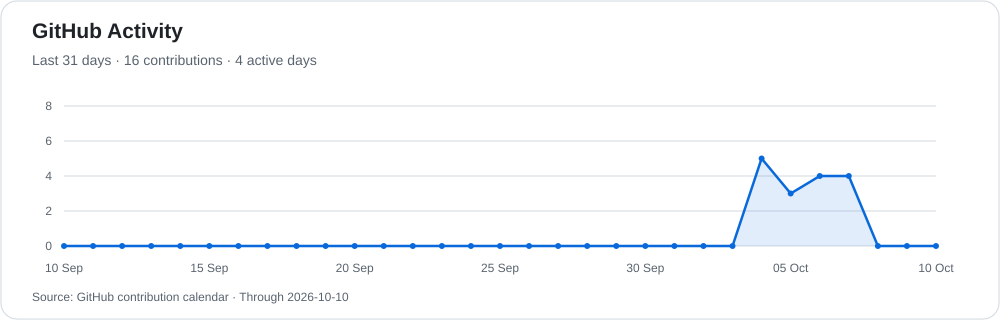

# Kong Ji Shou

**Game Development · Graphics Programming · Applied AI**

Computer Science student in Interactive Software Technology at TARUMT, Malaysia.

[Portfolio](https://kjishou.github.io/Portfolio/) · [Projects](https://github.com/KJiShou?tab=repositories) · [Research Presentation](https://kjishou.github.io/Portfolio/project/cgt-assignment)

## About Me

I build games and interactive applications, with a particular interest in the systems behind them: rendering, reusable components, physics, character behaviour, and performance. My projects span C++ and DirectX, Unity, parallel computing, Python machine learning, and Flutter.

I'm working towards becoming a game developer and welcome collaboration on game systems and interactive projects.

## Selected Projects

| Project | What I worked on | Technologies |
| --- | --- | --- |
| [Fly Me 2 The Earth](https://github.com/KJiShou/CGP_Assignment) | Reusable game components for sprite rendering, animation, UI, input, physics, and scene management, demonstrated in a playable spaceflight game. | C++, DirectX 9, DirectInput, FMOD |
| [Personality-Modulated NPC Emotion Dynamics](https://github.com/KJiShou/CGT-Assignment) | A team research prototype combining Big Five personality, VAD emotion states, dialogue context, and time-decayed memory. | Unity, C#, Sentis |
| [The Climb3](https://github.com/KJiShou/VR-Assignment) | VR climbing, hand interactions, stamina feedback, checkpoints, and timed progression. [Watch demo](https://youtu.be/MqeesJxqzsM). | Unity, C#, OpenXR |
| [Parallel QOI](https://github.com/KJiShou/parallel-qoi) | Two-pass lossless image encoding with Serial, OpenMP, CUDA, and MPI backends, plus an interactive comparison dashboard. | C++, CUDA, OpenMP, MPI, Electron |
| [Adult Face Detection Studio](https://github.com/KJiShou/AI_Assignment) | My role: ViT training and evaluation in a team comparison with CNN and HOG + SVM. ViT reached **84.21% accuracy** and **83.06% F1** on 3,945 test images. | Python, PyTorch, TensorFlow, OpenCV |
| [Accounting Mobile App](https://github.com/KJiShou/Accounting-Mobile-App) | Offline-first expense tracking, budgets, savings, spending insights, and cloud synchronization. | Flutter, Dart, SQLite, Supabase |
| [Sport Stacking Website](https://github.com/KJiShou/Sport-Stacking-Website) | Tournament management, athlete profiles, scoring, rankings, and reporting. | React, TypeScript, Firebase |

More games: [Chichi's Bizarre Adventure](https://github.com/KJiShou/3D-Game-Development) · [Desmos Lifeline](https://github.com/KJiShou/Desmos-Lifeline)

Some source repositories require access; screenshots and project details are available in my [portfolio](https://kjishou.github.io/Portfolio/).

## Research Presentation

**Presenter — International Joint Student Research Symposium 2026**
BINUS University, Indonesia · 21–25 September 2026

Presented **“Personality-Modulated NPC Emotion Dynamics for Game Dialogue”**, exploring how personality and emotional memory shape NPC responses to natural-language interaction.

[Project and presentation details](https://kjishou.github.io/Portfolio/project/cgt-assignment) · [Presenter certificate](https://kjishou.github.io/Portfolio/assets/certificates/ijsrs-2026-presenter.pdf)

## Technical Toolkit

| Area | Technologies |
| --- | --- |
| Games & graphics | C++, C#, Unity, DirectX 9, OpenGL, DirectInput, XR Interaction Toolkit |
| Parallel computing | CUDA, OpenMP, MPI |
| Machine learning | Python, PyTorch, TensorFlow / Keras, scikit-learn, OpenCV |
| Web & desktop | TypeScript, JavaScript, React, Tailwind CSS, Electron, Firebase |
| Mobile & data | Flutter, Dart, SQLite, Supabase |
| Development | Git, CMake, Visual Studio |

## GitHub Activity

<picture>
  <source media="(prefers-color-scheme: dark)" srcset="assets/activity-dark.svg" />
  <source media="(prefers-color-scheme: light)" srcset="assets/activity-light.svg" />
  
</picture>

The graph is refreshed daily by GitHub Actions. If an update fails, the last generated image remains available.
